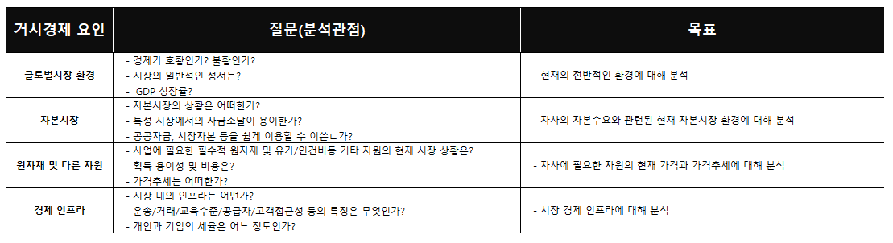

<본 자료는 데이터 분석 과제 수행을 위해 **분석 과제 정의 방법** 에 대해 ADP를 참조하여 정리한 내용입니다.>


# 데이터 분석 과제 정의 방법

**목차**
- [데이터 분석의 개요](#데이터-분석의-개요)
- [분석 기회 발굴](#분석-기회-발굴)
- [분석 기회 구조화](#분석-기회-구조화)
- [분석 기회 구체화](#분석-기회-구체화)
- [분석 활용 시나리오 정의](#분석-활용-시나리오-정의)
- [분석 정의서 작성](#분석-정의서-작성)
- [참고 자료](#참고-자료)


## 데이터 분석의 개요
데이터의 핵심은 분석을 통한 의사결정의 최적화 이다.   
최근 기업들은 데이터 분석의 중요성을 인지하면서 관심사였던 자원 활용의 최적화에서  
이제는 **분석을 활용한 의사결정의 최적화** 로 관심이 전환 되고 있다.

현업 담당자는 다양한 의사결정 상황에 직면 하며,
이때 어떤 의사결정을 내리는 가에 따라 의사결정의 전/후 상황이 많이 달라질 수 있다.
적시에 정확한 의사결정을 내리는 것은 업무나 프로젝트의 성과에 많은 영향을 미친다.

그러나 현실에서는 비지니스 이벤트가 발생시 대응하기 위한  
액션으로 이어지는 순간까지 **지연시간(Latency Time)** 이 발생하게된다.

#### 1. 지연시간의 종류
- 데이터 지연 시간
- 의사결정 지연 시간
- 분석 지연 시간

**Q. 의사 결정의 종류가 있을까?** <br/>전체 정보 취합 후 의사결정<br/>여러 상황에 대한 정보를 이해하고 하는 의사결정


#### 2. 데이터 분석 도입의 성공 요소
#####  가. Question First 방식으로 접근  
   데이터를 가공하면 유용한 정보가 산출된다는 접근이 아니라,
   업무에 필요한 분석이 무엇인지를 찾기위해 분석 질문을 먼저 정의하고,
   이를 위해 분석에 필요한 데이터가 무엇인지를 정의하는 방식으로 접근해야 한다.
   무엇을 분석할 것인지가 구체적이지지 않으면 아무리 투자해도 성과가 부진하다.

#####  나. 선택과 집중
   핵심 분석 몇가지만 잘해도 차별되고 카피할 수 없는 핵심 경쟁력을 가질 수 있다.
   볼보에서는 소비자의 자동차 운정과정에서 수집된 데이터를 축척 분석하여 이전에는
   50만 대의 차가 팔린 뒤에야 재기되었을 결함을 1,000대 판매 시점에서 포착하여
   사후 관리 비용을 크게 줄이게 되었다. 즉, 모든 것을 빠짐없이 리포팅/분석하는 데
   노력을 들이기보다는 비즈니스 모델을 강화할 수 있는 핵심 분석을 발굴하여
   점진적으로 확장하는 방식으로 접근하면 시행착오도 줄이고 핵심 경쟁력을 확보 할수 있다.


## 분석 기회 발굴

분석 기회란 기업의 **업무별 주요 의사결정 포인트**에 활용할 수 있는 분석의 후보들이다.
기업 활동은 일련의 수많은 의사결정 활동의 연속이며, 업무에 따라 다양한 의사 결정 상황에 직면하게 된다.

모든 의사결정 활동은 정확한 정보를 필요로하며, 이러한 정보를 어떻게 생성할 수 있는지,
분석이 필요한지, 분석이 필요하다면 어떤 분석이 필요한지를 검토 한다.


#### 분석기회 발굴 방식

**1. 비즈니스 모델 분석을 통한 Top-Down 접근 방식**  
- 기업의 비지니스 모델을 분석하여 경쟁력 강화를 위한 핵심 분석기회를 식별

**2. 대상 프로세스 선정/분석을 통한 Bottom Up 경로접근 방식**  
- 특정 대상 프로세스를 선정한 후 주제별로 분석 기회를 식별

**3. 분석 Use Case 벤치마킹 접근 방식**  
- 제공되는 산업별, 업무 서비스별 분석테마 후보 풀의 벤치마킹을 통한 분석 기회 식별


#### 1. 비지니스 모델 분석을 통한 Top Down 접근 방식
**비지니스 모델 분석을 통한 분석 기회 발굴 절차**
먼저 기업의 비지니스 모델에 대한 이해가 선행되고,  
비지니스 운영 시나리오를 통해 비지니스 모델을 상세화 한다.  
상세화한 기업 운영 시나리오를 기반으로 기업의 핵심 분석기회를 도출 

**가. 비지니스 모델 이해**

- 첫째, 당면한 비지니스 컨텍스트를 사업요인, 시장요인, 거시경제요인, 주요 트렌드 관점으로 파악
- 둘째, 이미 가시화된 니즈 뿐만 아니라 미충족 니즈인 새로운 블루오션 영역을 식별
- 셋째,  경쟁사와 비교하여 기업의 경쟁 요인을 선택 및 제공 가치 수준 설정


1) 비즈니스 컨텍스트 파악

시장요인


산업요인 


주요 트렌드


거시경제 요인




2) 고객 니즈 파악

고객의 상품/서비스 구매는 자신들의 니즈를 충족시키기 위한 행위이다. 따라서 기업의 비지니스 가치 창출의 시작점은 고객의 니즈가 무엇인가를 명확하게 파악하는 것부터 출발한다. 고객의 니즈는 다음의 4가지 가치 유형으로 구성할 수 있으며, 이러한 가치의 유형별 분류를 통해 고객니즈를 명확히 파악할 수 있다.

- 기능정 가치 (Functional Value) : 물리적 속성, 성능, 특징등 기능적 측면 (모바일 이용 or 이미지 업로드 기능)

- 재무적 가치 (Financial Value) : 무료, 저가격, 고가격

- 무형의 가치 (Intangible Value) : 공유성, 확장성, 이동성, 접근성

- 감성 가치 (Emotional Value) : 즐거움, 자긍심, 자유


3) 미충족 니즈 파악

- 경쟁사 선점 영역 (Defeated Territory) : 경쟁사는 충족하고 있지만 자사는 충족하지 못하는 영역

- 공통 경쟁 영역 (Fighting Territory) : 자사와 경쟁사가 공통으로 제공하는 고객 니즈 영역 (레드오션 영역)

- 자사 선점 영역 (Sweet Territory) : 자사는 충족하고 있지만 경쟁사는 충족하지 못하는 영역

- 미충족 고객 니즈 (Unmet Needs) : 자사와 경쟁사 모두 아직 파악하지 못한 고객 니즈 영역

  미충족 고객니즈는 기업의 새로운 비지니스 전략 방향의 단초가 될 수 있는 영역이다.


4) 경쟁 요인 선택 및 제공 가치 수준 설정

기업의 전략 목표 및 계획에 대해 조직의 모든 구성원이 쉽게 이해하고, 커뮤니케이션 하고, 창의적인 사고를 할 수 있도록 기업 전략을 수치가 아닌 시각적인 형태로 심프라헥 표현해주는 전략 캔버스를 활용하여 기업의 경쟁 방향을 설정할 수 있다. 


**나. 비지니스 모델 상세화**   

1. **경쟁 요소를 구체적으로 정의**하기 위해 비지니스 모델 상세화 를 한다.
2. 비지니스 모델 상세화를 구체화하기 위해 아래 두 작업 진행
3. 기업의 **전략테마/실행활동 간 관계 분석**을 위한 도구로 활동체계 지도(Activity System Map)를 사용
4. **비지니스 운영 상세 시나리오**는 **인과지도(Causal Loop Diagram, CLD)**를 사용해 정의


**■ 전략테마와 실행활동 간 관계 분석 (활동체계지도, Activity System Map)**  

1. 비지니스 모델 단계에서 정의된 전략 캔버스를 바탕으로 전략 테마를 정의
2. 전략 테마를 실현하기 위한 실행활동을 도출
3. 전략테마와 실행활동 간의 관계 정의 (점선이 실행활동)


**■ 비지니스 운영 시나리오 상세화 (CLD 작성)**<br/>

1. 전략테마/실행활동 간 관계 분석을 통해 도출된 내용을 바탕으로 운영 시나리오 상세화
   - 운영 시나리오 정의 방법 : 선택(Choice) - 이론(Theory) - 결과(Consequence)
2. 결과의 유형
   - 민감한 결과 (Fiexible) : 선택의 변경에 따라 민감하고 급속하게 변화되는 결과
   - 견고한 결과 (Rigid) : 선택의 변경이 발생하더라도 영향이 천천히 발생하는 결과
3. 이론은 선택에 따른 결과를 발생시키는 것
   - `예로는 '저렴한 가격을 선호하는 여행객이 몰릴 것이다.'


- Causal Loop Diagram 작성 절차  
  1) 선택 목록을 작성 한다.  
  2) 각 선택에 대한 직접적인 결과를 찾는다.  
  3) 스텝 2에서 발견한 결과가 자체적으로 중요한 결과를 갖는지 판단한다.  
  4) 결과가 없을때까지 스텝 3을 반복한다.  
  5) 견교한(RIGID) 결과를 선별하고 표시한다. (주로 박스로 표시)  
  6) 선별된 결과가 몇몇 선택을 발생시키는지 체크 (결과로부터 선택으로 화살표 작성)  
  7) 이프로세스가 끝났을 때, 선순환하는지 확인하고 순환이 얼마나 강한지 판단  


**다. 분석 유즈 케이스 정의 단계**

1) 분석 유즈 케이스 발굴 (CLD 분석)  
CLD의 이론(Theory)을 분석하여, 분석 유즈 케이스 (Analytics use Case)를 찾아낸다.   
여기서 분석 유즈 케이스란 분석을 적용하였을 때 업무흐름을 개념적으로 설명한 것이다.

- 분석 유즈 케이스는 비지니스 모델을 구성하는 이론(Theory)을 설명한다.
- 분석 유즈 케이스는 하나 이상의 분석(Analytics)을 포함한다.  


EX) 


2) 분석 유즈 케이스 정의 (이벤트 반응 분석)


도출된 분석 유즈 케이스를 상세히 정의하고,  
필요한 분석(Analytics)를 찾아내기 위해 프로세스 흐름을  
시작부터 종료까지 표현하는 이벤트 반응 다이어그램(Event Response Diagram)을 활용 한다.

아래 그림은 이벤트 반응 다이어그램은 프로세스 흐름을 시작부터 종료까지 표현하는 다이어그램으로,  
분석 유즈 케이스를 상세하게 정의하고 필요한 분석을 찾아내기 위해 사용한다.


- 액터
  - 이벤트 주체로서 사람이나 기업등의 실체 또는 정보시스템
  - 사람 아이콘으로 표시
  - 이벤트를 촉발시키는 역할 또는 반응 결과를 접수하는 역할을 한다.
- 이벤트
  - 반응을 촉발시키는 것으로 화살표 도형으로 표시
  - 외부 이벤트와 시간 이벤트로 구분
    - 외부 이벤트 : 시스템 외부에서 발생하는 것으로써, 항상 액터가 존재하며, '동사+명사' 형태로 명명
    - 시간 이벤트 : 특정 조건 또는 시기로서 액터가 존재하지 않으며 '~시기' 형태로 명명함
- 반응
  - 수행하는 활동으로 모서리가 둥근 직사각형으로 표시
  - '명사+동사' 형태로 표현
  - 반응이 실행되면 새로운 이벤트 또는 다른 반응이 시작 됨
- 분석
  - 가치 있는 결론을 도출하는 과정으로 원으로 표시
  - '명사+동사+분석' 형태로 표현하며, 분석이 실행되면 반응에서 분석을 수행
- 흐름
  - 액터, 이벤트, 반응 등의 선후관계와 연결관계로서 선으로 표시
  - 흐름은 명칭을 부여하지 않음
  - 흐름을 통해 데이터 또는 정보가 전달되면, 데이터 또는 정보의 이름을 적음
  - 단, 하나의 반응에서 두 가지 이상의 결과가 발생하는 경우 분석 조건을 표시


3) 분석 평가
분석 유즈 케이스 정의를 통해 발굴된 분석을 평가하여 핵심 분석을 발견해야한다.  
핵심 분석은 비지니스 모델의 경쟁요인과 관련되는 분석으로 가장 많은 경쟁요인과 관련될 수록 보다 핵심 분석이다.  
분석 평가는 다음 기준별 기업 특성에 따라 가중치를 부여하고, 가중 평균값으로 평가하여 분석 우선순위를 평가할 수 있다.

- 중요도 : CLD의 이론을 ㅣ원하는 정도로 측정. 클수록 높다

- 영향도 : 얼마나 많은 사용자를 지원하는가로 측정, 클수록 높다

- 난이도 : 비지니스 및 기술적으로 적용하기 쉬운 정도, 쉬울수록 높다


#### 2. 프로세스 선정/분석을 통한 Bottom Up 접근 방식


test

#### 3. 분석 Use Case 벤치마킹 접근 방식
test
test


## 분석 기회 구조화
<버스 노선 개선 예시로 설명 진행>

#### 1. 유저스토리 정의

식별 및 도출 된 핵심 분석 기회 별로  
분석자의 **역할**, **의사결정 사항**, 분석을 통해 추구하는 **목표 가치**를  
기술하여 분석하고자 하는 기회를 명확화한다.

```
<역할> 로서 나는 
<의사결정 사항> 할 수 있는 능력이 필요합니다.
이를 통해 나는 
<목표 가치> 할 수 있습니다.
```

업무 담당자 입장에서 무엇을 의사결정 해야 하는지를 정의한다.  
즉, 주요하게 의사결정해야 하는 업무가 무엇인지를 정의하는 것이다.

의사결정해야 할 업무가 정의되었다면,  
이 업무를 잘 수행하기 위해 업무 담당자는 '무엇을' 알아야 하는지 정리 한다.

분석기회는 바로 이 알아야 하는 '무엇을' 찾는 방법이다.  
즉 의사결정 요소인 그 무엇을 산출하기 위한 데이터 분석 포인트가 바로 분석 기회다.


#### 2. 목표 가치 구체화 (지표화)

유저스토리를 통해 정의된 분석 기회의 목표 가치를 지표화함으로써,  
분석을 통해 달성하려는 사업 성과를 구체화 한다.

프로세스에 분석을 내재화하고 주요 업무 의사결정에 분석을 활용하고자 하는 것은  
IT 자원 및 인력, 시간 등의 리소스가 투입되기에 투입대비 업무 성과 평가가 필요하다.

성과는 측정 가능한 형태인 지표로 정의 될때 잘 관리되며,  
따라서 분석 기회를 통해 달성해야 할 목표 가치를 지표로 정의하여 관리해야 한다.


#### 3. 분석 질문 구체화

##### 가. 분석 질문 도출 개요
유저스토리로 정의한 의사결정 사항의 달성을 위해 답해야 하는 질문이 무엇인지 식별해야 한다.  
예제로 A시 버스노선 정책 담당자는 개선이 필요한 버스 노선이 어디인지 식별해야 한다.  
의사결정 사항 달성을 위해 담당자는 '개선이 필요한 버스 노선이 어디지?' 라는 질문을 할 수 있다.
담당자는 '개선이 필요한 버스 노선이 어디인지 식별하기 위해 무슨 분석을 해야 하는거지?'등  
의사결정에 필요한 정보를 얻기 위해 필요한 분석을 찾아내야 한다.

이러한 분석을 찾아내기 위한 질문이 바로 분석 질문이다.  
분석 질문을 잘 만들어 내야만 필요한 분석을 찾아낼 수 있다.

질문을 구체화 하는 방법은 2가지가 있다.  
1) 분석 기회의 답을 얻기 위해 연속하여 필요한 질문을 하는 방식
2) 분석 질문의 정의를 돕기위해 각 관점에서 해당 질문과 관련된 요소를 리스트업 하는 방식


##### 나. 분석 질문 도출 방법
1) 연속 질문 방식  
담당자 입장에서 도출한 분석 기회의 답을 얻기 위해서는 많은 다른 분석들이 필요  
많은 다른 분석들을 찾기 위해서는 질문에서 질문으로 연관된 질문을 계속 만들어 가는 것이 중요  
분석기회의 답을 얻기 위해서 필요한 분석 질문들을 계속 해야한다. 


분석 질문을 정의할 때 주목할 것은 질문 도출 시 분석 컨텍스트 및 필요 분석까지 같이 도출할 수 있다는 것이다.  A시 버스 노선 개선의 경우, 분석 기회가 '개선이 필요한 버스 노선 식별' 이기에   
가장 처음 할 수 있는 질문(분석 기회 질문)은 '개선이 필요한 버스 노선이 어디지?, 어떻게 식별하지?' 이다.  
이러한 분석 질문에 답을 얻기 위해 개선이 필요한 버스 노선과 개선의 원인을 찾기 위한 질문들이 계속 필요하다.   이러한 분석 질문이 도출되면, 분석의 질문에 답하기 위해 필요한 분석 컨텍스트(대상)를 도출 할 수 있고,  
이 분석 컨텍스트(대상)를 대상으로 무슨 분석을 수행해야 하는지에 대해 정의까지 진행할 수 있다.


1. 위 예제의 경우로 설명을 하면 나는 정거장마다 사람이 붐비는 노선을 찾아야 한다.

2. 이에 따라 '정거장마다 항상 사람이 붐비는 노선은?/ 자주 붐비는 노선을 어떻게 식별하지?' 질문을 할 수 있다.

3. 위 질문이 바로 정거장마다 항상 사람이 붐비는 노선을 찾기 위해 필요한 분석을 도축하기 위한 질문이다. 

4. 이 질문을 위한 분석 컨텍스트는 '승객 과대 노선'이고, 
5. <버스별로 시간대별 버스의 승객 수를 분석> 하면 사람이 붐비는 노선이 어디인지 찾을 수 있을 것이다.
6. 항상 사람이 붐비는 노선을 찾았다면, 우리는 혼잡을 유발하는 원인을 찾기 위한 질문을 추가로 할 수 있다.
7. 원인을 분석해야 적절한 개선방안을 수립할 수 있다.
8. 따라서 '우리는 버스에 이렇게 승객이 과다 탑승하는 이유는 무엇일까?'를 질문하며,
9. 발생 가능한 원인들을 일부 가정해 본다. 우리의 가정을 또한 질문 형식으로 만들어 본다.
10. '버스에 승객이 과다 탑승하는 이유는 무엇일까?'
11. '그 버스가 지나가는 경로의 지역적 특성 때문인가?'
12. '그 버스의 배차간격 때문인가?'
13. '버스 경로 내 지하철 때문인가?'
14. '혹시 버스 노선 내 지하철역이 존재하는 버스 노선의 혼잡도가 그렇지 않은 버스노선 보다 높나?'
15. '그 버스가 지나가는 경로의 지역적 특성 떄문일까?'
16. 라는 질문에 답하기 위해 지역 특성을 분석 컨텍스트로 하여
17. <혼잡 버스의 지역 특성분석 승객이 많이 승하차하는 정거장 주변 지역 특성 분석>
18. <버스노선의 정거장별 승하차 인원 수 분석>
19. <동일 경로를 지나는 다른 버스노선의 정거장별 승하차 인원 수 비교 분석> 을 수행 할 수 있다.
20. '그 버스의 배차간격 때문인가?' 라는 질문에 답하기 위해 배차간격을 분석 컨텍스트로 하여
21. <혼잡 버스의 배차 간격 분석>을 수행해 볼 수 있다.
22. '버스 경로 내 지하철 떄문인가?'
23. (혹시 버스 노선에 지하철역이 존재하는 버스의 혼잡도가 그렇지 않은 버스보다 높나?)
24. 라는 질문에 답하기 위해 버스 경로 내 지하철역 유무를 분석 컨텍스트로 하여
25. <혼잡 버스 노선 내 지하철역 유무 분석>을 수행해 볼 수 있다.

분석 질문을 하나 만들어 나갈 때 궁극적으로 나의 의사결정 사항 달성을 위해 내가 알아야 하는 분석 값을 산출할 수 있는 질문들을 정의하고, 이 값을 알기 위해 필요한 서브 분석들을 찾아내기 위한 분석 질문들을 지속적으로 만들어 나가야 한다. 하나의 분석 질문이 정의되면 지속적으로 그 분석 질문의 답을 얻기 위해 필요한 서브 분석들이 정의될 것이다.


2) 에이전트, 객체/장소, 이벤트 관점의 질문  
관련 있는 분석 질문을 빠짐없이 도출하고자 하는 목적의 도구  
이 도구를 사용하여 분석 질문을 정의하는 것은 필요에 따라 활용여부를 판단할 수 있다.


예시) A시 개선 필요 버스 노선을 식별하기 위해 도출된 에이전트, 객체/장소, 이벤트는 다음과 같다.


**우리는 개선해야할 버스 노선을 식별하기 위한 분석을 필요로한다.**

분석질문을 도출하기 위해 분석결과 활용 및 분석결과에 영향을 받는 이해관계자인 에이전트를 식별해 볼 수 있다.

- 개선이 필요한 버스 노선으로 인해 불편을 느끼는 사람인 A시 버스 이용자,

- 개선이 필요한 버스 노선에 대한 정보를 활용하는 A시 버스 노선 담당자를 에이전트로 식별할 수 있다.

우리는 버스 노선의 개선이 필요하다는 시그널을 확보할 수 있는 대상 및 장소(정적)를 도출해 볼 수 있다.

무엇을 분석해 보면 버스노선의 개선이 필요하다는 것을 파악할 수 있을까를 곰곰히 생각한다.

- 민원접수 채널을 통해 들어오는 정보를 분석해 보면 개선이 필요한 버스를 확인할 수 있을까?
- 버스앱을 통해 검색이 빈번히 발생한 노선들은 개선이 필요할까?
- 배차 간격이 버스 개선의 원인이 될 수 있을까?
- 버스가 지나가는 경로의 지역 특성이 버스 개선의 원인이 될 수 있을까?

이렇게 버스의 개선이 필요함에 대한 시그널을 확보할 수 있는 대상 및 장소를 정의해 볼 수 있다.


분석 질문은 아래와 같이 도출된 에이전트, 객체/장소, 이벤트별로 포스트 잇을 사용하여 분석 질문을 정리해 가는 방법으로 진행하면 중복된 질문도 효과적으로 식별되고 유사 질문도 그룹핑하기 용이하다.


##### 다. 분석 질문 정련

분석질문을 1차 도출했으면 해당 분석 질문의 답이 우리가 필요한 의사결정에 필요한 답인지 재검토 통해 분석 질문이 정확하게 도출되었는지를 확인해 보아야 한다.

재검토의 포인트는 우리가 궁극적으로 알고자 하는 분석 기회 질문에 대한 답을 도출 할 수 있는 질문인지 확인 하는 것이다.

따라서 서브 질문의 답을 생각하며, 그 질문의 답을 얻으면 핵심 분석 기회 질문에 답을 얻을 수 있는지를 역으로 생각해 본다. 그래서 서브 분석 질문의 답이 핵심 분석 기회 답과 관련이 없어 보이면, 왜 그런지 사유를 기입한다. 이런 방법으로 좀 더 정확하게 우리에게 꼭 필요한 분석 질문을 최종 도출 할 수 있다.


## 분석 기회 구체화
#### 1. 의사결정 요소 모형화
우리는 앞서 분석 질문들을 정의했고, 분석 질문별 분석 컨텍스트와 분석을 도출 했다.
여기서 우리는 분석 컨텍스트 간 상관관계를 모형화한다.

이를 통해 의사결정을 위한 일련의 제 요소와 요소 간 관계를 구체화 할 수 있다.
우리는 의사 결정 요소 모형화를 통해
분석의 핵심 이슈와 의사결정을 위한 필요 요소를 한 장의 그림으로 분명하게 설명할 수 있다.

분석의 핵심 이슈란 어떤 업무에 분석이 필요한지?
즉, 분석의 결과를 통해 의사결정 해야 할 업무가 무엇인지를 정의하는 것이다.

의사결정 요소는 이러한 의사결정 업무를 최적으로 수행하기 위해서는 무엇을 알 필요가 있나?
즉, 최적의 의사결정을 위해 필요한 분석들을 찾아내야 하는데
바로 이러한 분석들이 의사결정 요소 인것이다.


#### 2. 분석 체계 도출

정의된 의사결정 모형의 분석 컨텍스트별로 수행할 분석을 정리하여 의사결정을 위한 전체 분석 세트와 관계를 도출한다. 이렇게 도출된 각 분석들의 관계와 집합은 의사결정을 위한 시그널 허브로 작동하게 된다.

즉 최종 의사결정을 돕는 분석의 결과 값들이 도출되기 전 중간단계의 분석결과들도 의사결정자들에게 필요한 시그널로 제공하게 된다.

의사결정 모형의 각 분석체계는 한 번에 확장되지 않고, 지속적으로 보완되는 과정을 거쳐 정렬된다.


#### 3. 분석 필요 데이터 정의

분석체계에 따라 분석에 필요한 데이터 및 데이터의 유형을 식별하여 현재 기업에서 보유한 데이터와 외부에서 확보해야 할 데이터를 정의한다.

이는 데이터 확보의 가능성과 비용요인을 고려하여 향후 분석의 우선순위와 범위를 조정할 때 활용할 수 있다.


#### 4. 분석 ROI 평가

분석 기회를 정의하고 필요한 분석을 도출한 것은 업무 의사결정에 분석을 활용함으로써 의사결정의 적시 정확성을 높이고 업무적 성과를 효과적으로 달성하고자 함이다.

따라서 필요한 분석을 찾고 분석을 위한 필요 데이터를 정의한 시점에 반드시 점검해야 할 포인트는 분석에 대한 경제성 평가다.

즉 분석에 필요한 데이터는 확보가 쉬운 데이터인지?

데이터 확보를 위해 비용은 얼마나 드는지?

분석을 통해 얻게 되는 업무적 성과는 비용 대비 얼마나 되는지? 등을 검토해야 한다.

자칫 분석에만 매몰되다 보면 분석을 통해 얻게 되는 업무적 성과보다 더 많은 비용을 초래하게 되어 분석을 통해 얻고자 했던 목표를 상실한 채 기업에 오히려 손실을 끼칠 수 있게 된다.


## 분석 활용 시나리오 정의

분석 컨텍스트를 기반으로 도출된 분석 체계를 종합적으로 고려하여 업무적인 분석 활용 시나리오를 정의 한다. 분석 활용 시나리오 정의 목적은 주요 업무 의사결정에 분석 결과가 어떻게 활용되어 업무를 효과적으로 수행할 수 있는지를 명확하게 이해하도록 돕니다.
[사진1]
[사진2]
분석을 업무운영 프로세스에 반영할 떄, 기존 프로세스가 변경되거나 신규 프로세스가 생성되는 등 업무 프로세스의 변화가 발생하기도 한다. 즉 과거에는 데이터 분석이 필요하면, 분석을 별도로 진행하여 업무에 분석을 참조하던 것과는 달리, 분석을 업무 프로세스에 내재화 화면 운영 업무의 후행 액션이 분석에 의해 자동으로 실행되는 형태로 프로세스가 지능화 된다.,

분석으로 인한 프로세스 지능화는 기업의 업무 프로세스 재설계를 동반한다. 따라서, 분석의 업무 활용 시나리오 정의 시, 분석으로 인한 업무 프로세스 변화를 명확히 식별하고 재설계 방안을 정의 해야 한다.
[사진]


## 분석 정의서 작성
분석 활용 시나리오와 분석 체계를 분석 정의서를 통해 보다 상세하게 정의한다.
즉 분석별로 필요한 소스 데이터, 분석 방법, 데이터 입수 및 분석의 난이도, 분석수행 주기, 분석결과에 대한 검증 오너십, 상세 분석 과정을 정의한다. 분석 데이터 소스는 내부의 비구조적인 데이터와 외부 소셜미디어/공공 오픈 데이터까지 범위를 확장하여 고려하고, 분석방법 또한 예측분석, 최적화 기법 등으로 기존 분석기법에서 방식 확장을 고려해야 한다.


## 참고자료
- ADP의 데이터 분석 기획 파트 참조

