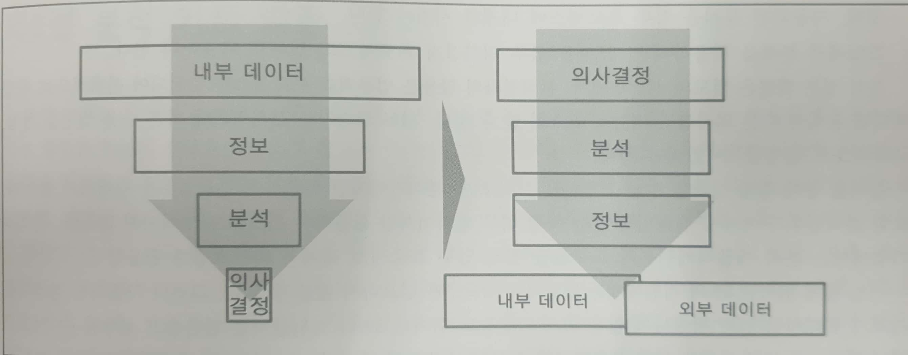

<본 자료는 데이터 분석 과제 수행을 위해 **분석 과제 정의 방법** 에 대해 ADP를 참조하여 정리한 내용입니다.>

# 데이터 분석 과제 정의 방법

**목차**
- [데이터 분석의 개요](#데이터-분석의-개요)
- [분석 기회 발굴](#분석-기회-발굴)
- [분석 기회 구조화](#분석-기회-구조화)
- [분석 기회 구체화](#분석-기회-구체화)
- [분석 활용 시나리오 정의](#분석-활용-시나리오-정의)
- [분석 정의서 작성](#분석-정의서-작성)
- [참고 자료](#참고-자료)

## 데이터 분석의 개요

데이터의 핵심은 분석을 통한 의사결정의 최적화 이다. 최근 기업들은 데이터 분석의 중요성을 인지하면서 관심사였던 자원 활용의 최적화에서 이제는 **분석을 활용한 의사결정의 최적화** 로 관심이 전환 되고 있다.

현업 담당자는 다양한 의사결정 상황에 직면한다.
이때 어떤 의사결정을 내리는 가에 따라 의사결정의 전/후 상황이 많이 달라질 수 있다.
적시에 정확한 의사결정을 내리는 것은 업무나 프로젝트의 성과에 많은 영향을 미친다.

그러나 현실에서는 비지니스 이벤트가 발생시 대응하기 위한 액션으로 이어지는 순간까지 **지연시간(Latency Time)** 이 발생하게된다.

### 지연시간의 종류
- 데이터 지연 시간
- 의사결정 지연 시간
- 분석 지연 시간

***Q. 의사 결정의 종류가 있을까?*** 
전체 정보 취합 후 의사결정
여러 상황에 대한 정보를 이해하고 하는 의사결정

### 데이터 분석 도입의 성공 요소
#### 1. Question First 방식으로 접근   
   데이터를 가공하면 유용한 정보가 산출된다는 접근이 아니라,
   업무에 필요한 분석이 무엇인지를 찾기위해 분석 질문을 먼저 정의하고,
   이를 위해 분석에 필요한 데이터가 무엇인지를 정의하는 방식으로 접근해야 한다.
   무엇을 분석할 것인지가 구체적이지지 않으면 아무리 투자해도 성과가 부진하다.

#### 2. 선택과 집중
   핵심 분석 몇가지만 잘해도 차별되고 카피할 수 없는 핵심 경쟁력을 가질 수 있다.
   볼보에서는 소비자의 자동차 운정과정에서 수집된 데이터를 축척 분석하여 이전에는
   50만 대의 차가 팔린 뒤에야 재기되었을 결함을 1,000대 판매 시점에서 포착하여
   사후 관리 비용을 크게 줄이게 되었다. 즉, 모든 것을 빠짐없이 리포팅/분석하는 데
   노력을 들이기보다는 비즈니스 모델을 강화할 수 있는 핵심 분석을 발굴하여
   점진적으로 확장하는 방식으로 접근하면 시행착오도 줄이고 핵심 경쟁력을 확보 할수 있다.

***
## 분석 기회 발굴

분석 기회란 기업의 **업무별 주요 의사결정 포인트**에 활용할 수 있는 분석의 후보들이다.
기업 활동은 일련의 수많은 의사결정 활동의 연속이며, 업무에 따라 다양한 의사 결정 상황에 직면하게 된다.

모든 의사결정 활동은 정확한 정보를 필요로하며, 이러한 정보를 어떻게 생성할 수 있는지,
분석이 필요한지, 분석이 필요하다면 어떤 분석이 필요한지를 검토 한다.

### 분석기회 발굴 방식

**1. 비즈니스 모델 분석을 통한 Top-Down 접근 방식**
​    기업의 비지니스 모델을 분석하여 경쟁력 강화를 위한 핵심 분석기회를 식별

**2. 대상 프로세스 선정/분석을 통한 Bottom Up 경로접근 방식**
​    특정 대상 프로세스를 선정한 후 주제별로 분석 기회를 식별

**3. 분석 Use Case 벤치마킹 접근 방식**
​    제공되는 산업별, 업무 서비스별 분석테마 후보 풀의 벤치마킹을 통한 분석 기회 식별

#테스트

이런식으로 

***
## 분석 기회 구조화

***
## 분석 기회 구체화

***
## 분석 활용 시나리오 정의

***
## 분석 정의서 작성

**

## 참고자료
- ADP
